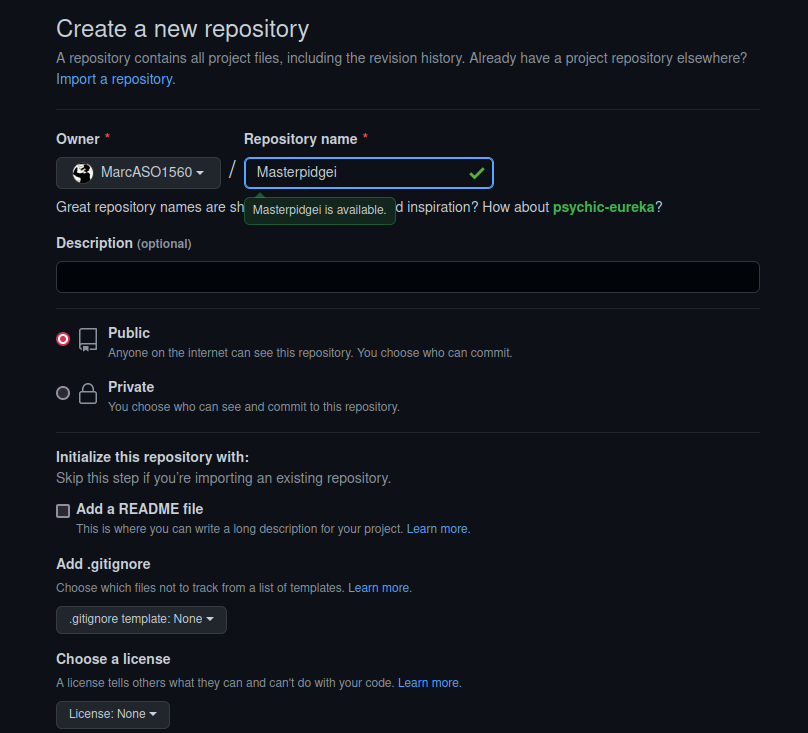
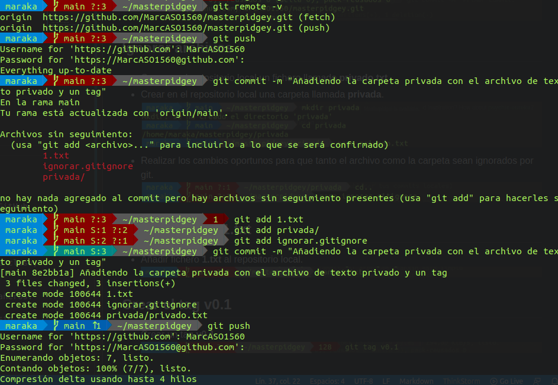
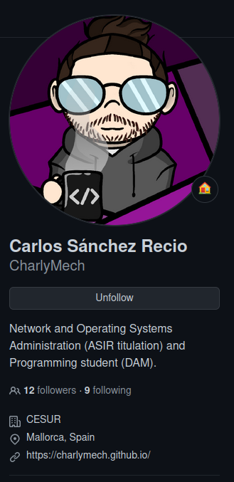
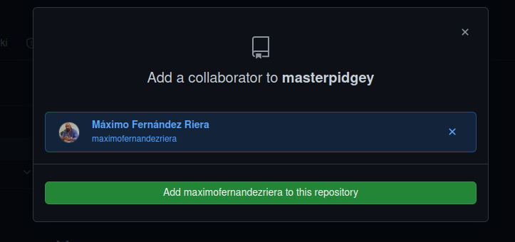

# masterpidgey
## Enunciado ejercicios básicos de Git, GitHub (Parte 1)
- Crear un repositorio en vuestro GitHub llamado **masterpidgey**.

- Clonar vuestro repositio en local.

## Commit inicial

- Añadir al README.md los comanddos utilizados hasta ahora
y hacer un coomit inicial con el mensaje **commit inicial**.

## Push inicial

- Subir los cambios al repositorio remoto.

## Ignorar archivos

- Crear en el repositorio local un fichero llamado **privado.txt**.
- Crear en el repositorio local una carpeta llamada **privada**.

- Realizar los cambios oportunos para que tanto el archivo como
la carpeta sean ignorados por git.

## Añadir fichero 1.txt

- Añadir fichero **1.txt** al repositorio local.

## Crear el tag v0.1

- Crear un tag **v0.1**.

## Subir el tag v0.1

- Subir los cambios al repositorio remoto.

## Cuenta de GitHub

- Poner una foto en vuestro perfil de GitHub.

- Poner el doble factor de autentificación en vuestra cuenta de GitHub (opcional).

## Uso social de GitHub

- Preguntar los nombres de usuario de GitHub de tus compañeros de clase, búscalos, y sigueles.(Ejemplo)

- Seguir los repositorios **masterpidgey** del resto de tus compañeros.

- Añadir una estrella a los repositorios **masterpidgey** del resto de tus compañeros.
## Crear una tabla

- Crear una tabla de este estilo en el fichero **README.md**
con la información de varios de tus compañeros de clase:

|        NOMBRE          |                     GITHUB                        |
|------------------------|---------------------------------------------------|
| Nombre del compañero 1 | [Carlos Sanchez](http://github.com/CharlyMech) |
| Nombre del compañero 2 | [David Tous](http://github.com/DavidTous) |
| Nombre del compañero 3 | [Isaac](http://github.com/IsaacLolade) |

## Colaboradores

- Poner a [github.com/maximofernandezriera](http://github.com/maximofernandezriera)
como colaborador del repositorio **masterpidgey**

# Enunciado ejercicios avanzados de Git, GitHub (Simulación examen parte 2)

## Notas

- Este ejercicio es continuación del anterior por lo que
tendréis que seguir trabajando en el repositorio **masterpidgey**.

- También tendreís que ir poniendo los **comandos**
que habéis tenido que utilizar durante todos los ejercicios
y las **explicaciones y capturas de pantalla** que consideréis **necesarias** al fichero README.md del citado repositorio.

## Crear una rama v0.2

- Crear una rama **v0.2**.

- Posiciona tu carpeta de trabajo en esta rama.

## Añadir fichero 2.txt

- Añadir un fichero **2.txt** en la rama **v0.2**.

## Crear rama remota v0.2

- Subir los cambios al reposiorio remoto.

## Merge directo

- Posicionarse en la rama **master**.

- Hacer un merge de la rama **v0.2** en la rama **master**.

## Merge con conflicto

- En la rama **master** poner **Hola** en el fichero **1.txt** y hacer commit.

- Posicionarse en la rama **v0.2** y poner **Adios** en el fichero "1.txt" y hacer commit.

- Posicionarse de nuevo en la rama **master** y hacer un merge con la rama **v0.2**

## Listado de ramas

- Listar las ramas con merge y las ramas sin merge.

## Arreglar conflicto

- Arreglar el conflicto anterior y hacer un commit.

## Borrar rama

- Crear un tag **v0.2**

- Borrar la rama **v0.2**

## Listado de cambios

- Listar los distintos commits con sus ramas y sus tags.

## Crear una organización

- Crear una organización llamada **masterpidgey-tunombredeusuariodegithub**

## Crear equipos

- Crear 2 equipos en la organización **masterpidgey-tunombredeusuariodegithub**,
uno llamado **administradores** con más permisos y otro **colaboradores** con menos permisos ¿es posible?.

- Meter a [github.com/maximofernandezriera](http://github.com/maximofernandezriera) y a 2 de vuestros
compañeros de clase en el equipo **administradores**.

- Meter a [github.com/maximofernandezriera](http://github.com/maximofernandezriera) y a otros 2 de vuestros
compañeros de clase en el equipo **colaboradores**.

## Crear un index.html

- Crear un index.html que se pueda ver como página web en la organización.

## Crear pull requests

- Hacer 2 forks de 2 repositorios **masterpidgey-tunombredeusuariodegithub.github.io**
de 2 organizaciones de las que no seais ni administradiores ni colaboradores.

- Crearos una rama en cada fork.

- En cada rama modificar el fichero **index.html** añadiendo vuestro nombre.

- Con cada rama hacer un pull request.

## Gestionar pull requests

- Aceptar los pull requests que lleguen a los repositorios de tu organización.
